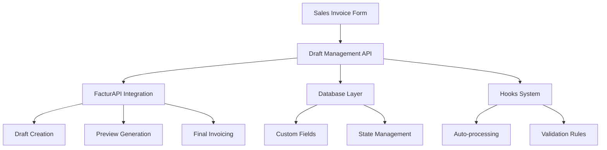

# 👨‍💻 Development Guide - Draft Workflow

Guía completa para desarrolladores sobre la implementación y extensión del sistema de **Draft Management**.

## 🏗️ Arquitectura del Sistema

### Componentes Principales



### Flujo de Datos

```python
# 1. Sales Invoice Creation
sales_invoice.fm_create_as_draft = 1
sales_invoice.save()

# 2. Hook Triggered
def on_submit(doc, method):
    if doc.fm_create_as_draft:
        create_draft_invoice(doc.name)

# 3. API Layer
def create_draft_invoice(sales_invoice_name):
    payload = build_cfdi_payload(sales_invoice)
    response = send_to_factorapi(payload, draft=True)
    update_draft_fields(sales_invoice_name, response)

# 4. State Update
frappe.db.set_value("Sales Invoice", name, {
    "fm_draft_status": "Borrador",
    "fm_factorapi_draft_id": response["draft_id"]
})
```

## 🗃️ Estructura de Base de Datos

### Custom Fields Implementados

```python
# En sales_invoice_addenda_fields.py
draft_fields = [
    {
        "fieldname": "fm_create_as_draft",
        "fieldtype": "Check",
        "label": "Crear como Borrador",
        "default": 0,
        "description": "Crear factura en modo borrador para revisión"
    },
    {
        "fieldname": "fm_draft_status",
        "fieldtype": "Select", 
        "label": "Estado Borrador",
        "options": "\nBorrador\nEn Revisión\nAprobado\nTimbrado",
        "read_only": 1
    },
    {
        "fieldname": "fm_factorapi_draft_id",
        "fieldtype": "Data",
        "label": "ID Borrador FacturAPI",
        "read_only": 1
    },
    {
        "fieldname": "fm_draft_created_date",
        "fieldtype": "Datetime",
        "label": "Fecha Creación Borrador",
        "read_only": 1
    },
    {
        "fieldname": "fm_draft_approved_by",
        "fieldtype": "Link",
        "label": "Aprobado Por",
        "options": "User",
        "read_only": 1
    }
]
```

### Migrations y Updates

```python
# scripts/migrate_draft_fields.py
def migrate_existing_invoices():
    """Migrar facturas existentes al nuevo sistema de borradores"""
    
    # Agregar campos a facturas existentes
    frappe.db.sql("""
        ALTER TABLE `tabSales Invoice` 
        ADD COLUMN IF NOT EXISTS `fm_create_as_draft` INT(1) DEFAULT 0,
        ADD COLUMN IF NOT EXISTS `fm_draft_status` VARCHAR(140) DEFAULT '',
        ADD COLUMN IF NOT EXISTS `fm_factorapi_draft_id` VARCHAR(140) DEFAULT '',
        ADD COLUMN IF NOT EXISTS `fm_draft_created_date` DATETIME NULL,
        ADD COLUMN IF NOT EXISTS `fm_draft_approved_by` VARCHAR(140) DEFAULT ''
    """)
    
    # Actualizar índices para performance
    frappe.db.sql("""
        CREATE INDEX IF NOT EXISTS idx_draft_status 
        ON `tabSales Invoice` (fm_draft_status)
    """)
    
    frappe.db.commit()
```

## 🔧 Implementación de APIs

### Estructura de Módulos

```
facturacion_mexico/
├── draft_management/
│   ├── __init__.py
│   ├── api.py                    # APIs principales
│   ├── factorapi_client.py      # Integración FacturAPI
│   ├── validators.py            # Validaciones de negocio
│   └── hooks_handlers.py        # Event handlers
├── custom_fields/
│   └── sales_invoice_addenda_fields.py  # Custom fields
└── tests/
    └── test_draft_management.py         # Test suite
```

### API Implementation Patterns

```python
# Patrón para APIs robustas
@frappe.whitelist()
def api_endpoint(param1: str, param2: Optional[str] = None) -> Dict[str, Any]:
    """
    Template para APIs del sistema de borradores
    
    Args:
        param1: Parámetro requerido
        param2: Parámetro opcional
        
    Returns:
        Dict con formato estándar de respuesta
    """
    try:
        # 1. Validación de parámetros
        if not param1:
            return {"success": False, "message": "param1 es requerido"}
        
        # 2. Verificación de permisos
        if not frappe.has_permission("Sales Invoice", "read"):
            return {"success": False, "message": "Permisos insuficientes"}
        
        # 3. Lógica de negocio
        result = execute_business_logic(param1, param2)
        
        # 4. Respuesta exitosa
        return {
            "success": True,
            "message": "Operación exitosa",
            "data": result
        }
        
    except Exception as e:
        # 5. Manejo de errores
        frappe.log_error(f"Error en {api_endpoint.__name__}: {str(e)}")
        return {
            "success": False,
            "message": f"Error interno: {str(e)}"
        }
```

### FacturAPI Integration Layer

```python
# facturacion_mexico/draft_management/factorapi_client.py
import requests
import frappe
from typing import Dict, Any, Optional

class FactorAPIClient:
    """Cliente para integración con FacturAPI"""
    
    def __init__(self):
        self.base_url = frappe.conf.get("factorapi_base_url", "https://www.facturapi.io/v1")
        self.api_key = frappe.conf.get("factorapi_secret_key")
        
        if not self.api_key:
            frappe.throw("FacturAPI API key no configurada")
    
    def create_draft(self, invoice_data: Dict[str, Any]) -> Dict[str, Any]:
        """Crear borrador en FacturAPI"""
        endpoint = f"{self.base_url}/invoices"
        
        # Marcar como borrador
        invoice_data["draft"] = True
        
        response = requests.post(
            endpoint,
            json=invoice_data,
            auth=(self.api_key, ""),
            headers={"Content-Type": "application/json"}
        )
        
        if response.status_code == 201:
            return {
                "success": True,
                "draft_id": response.json()["id"],
                "preview_url": response.json().get("preview_url")
            }
        else:
            return {
                "success": False,
                "message": f"Error FacturAPI: {response.text}"
            }
    
    def finalize_draft(self, draft_id: str) -> Dict[str, Any]:
        """Convertir borrador a factura final"""
        endpoint = f"{self.base_url}/invoices/{draft_id}/finalize"
        
        response = requests.post(
            endpoint,
            auth=(self.api_key, ""),
            headers={"Content-Type": "application/json"}
        )
        
        if response.status_code == 200:
            final_invoice = response.json()
            return {
                "success": True,
                "cfdi_uuid": final_invoice["uuid"],
                "cfdi_xml": final_invoice["xml"],
                "pdf_url": final_invoice["pdf_url"]
            }
        else:
            return {
                "success": False,
                "message": f"Error finalizando: {response.text}"
            }
```

## 🎣 Sistema de Hooks

### Event Handlers

```python
# facturacion_mexico/draft_management/hooks_handlers.py

def on_sales_invoice_submit(doc, method):
    """Hook ejecutado al submit de Sales Invoice"""
    try:
        if doc.get("fm_create_as_draft") and not doc.get("fm_draft_status"):
            # Auto-crear borrador al submit
            result = create_draft_invoice(doc.name)
            
            if not result.get("success"):
                # Log error pero no bloquear el submit
                frappe.log_error(
                    title="Error auto-creando borrador",
                    message=f"Invoice: {doc.name}, Error: {result.get('message')}"
                )
                
    except Exception as e:
        frappe.log_error(f"Error en hook sales invoice submit: {str(e)}")

def validate_draft_workflow(doc, method):
    """Validar flujo de trabajo de borradores"""
    try:
        # Prevenir borrador en facturas ya timbradas
        if doc.get("fm_create_as_draft") and doc.get("fm_cfdi_uuid"):
            frappe.throw("No se puede marcar como borrador una factura ya timbrada")
        
        # Limpiar campos si no es borrador
        if not doc.get("fm_create_as_draft"):
            doc.fm_draft_status = ""
            doc.fm_factorapi_draft_id = ""
            doc.fm_draft_created_date = ""
            doc.fm_draft_approved_by = ""
        
        # Validar transiciones de estado
        validate_state_transition(doc)
        
    except Exception as e:
        frappe.log_error(f"Error validando draft workflow: {str(e)}")

def validate_state_transition(doc):
    """Validar que las transiciones de estado sean válidas"""
    current_state = doc.get("fm_draft_status", "")
    
    # Definir transiciones válidas
    valid_transitions = {
        "": ["Borrador"],
        "Borrador": ["En Revisión", ""],
        "En Revisión": ["Aprobado", "Borrador"],
        "Aprobado": ["Timbrado"],
        "Timbrado": []
    }
    
    # Obtener estado anterior de BD
    if doc.name:
        old_state = frappe.db.get_value("Sales Invoice", doc.name, "fm_draft_status") or ""
        
        if current_state != old_state:
            if current_state not in valid_transitions.get(old_state, []):
                frappe.throw(f"Transición inválida de '{old_state}' a '{current_state}'")
```

### Registrar Hooks

```python
# En hooks.py principal
doc_events = {
    "Sales Invoice": {
        "on_submit": [
            "facturacion_mexico.draft_management.hooks_handlers.on_sales_invoice_submit"
        ],
        "validate": [
            "facturacion_mexico.draft_management.hooks_handlers.validate_draft_workflow"
        ],
        "before_save": [
            "facturacion_mexico.draft_management.hooks_handlers.before_save_cleanup"
        ]
    }
}
```

## 🧪 Testing Strategy

### Test Layers

```python
# Layer 1: Unit Tests
class TestDraftManagementUnit(unittest.TestCase):
    """Tests de funciones individuales"""
    
    def test_build_cfdi_payload(self):
        """Test construcción de payload"""
        pass
    
    def test_validate_state_transition(self):
        """Test validaciones de estado"""
        pass

# Layer 2: Integration Tests  
class TestDraftManagementIntegration(unittest.TestCase):
    """Tests de integración con FacturAPI (mocked)"""
    
    def test_complete_draft_workflow(self):
        """Test flujo completo con mocks"""
        pass

# Layer 3: End-to-End Tests
class TestDraftManagementE2E(unittest.TestCase):
    """Tests end-to-end con datos reales"""
    
    def test_real_factorapi_integration(self):
        """Test con FacturAPI real (sandbox)"""
        pass
```

### Mocking Utilities

```python
# test_utils.py
from unittest.mock import patch, MagicMock

class FactorAPIMockManager:
    """Manager para mocks de FacturAPI"""
    
    @staticmethod
    def mock_create_draft_success():
        return {
            "success": True,
            "draft_id": "test_draft_123",
            "preview_url": "https://test.factorapi.io/preview/123"
        }
    
    @staticmethod
    def mock_create_draft_error():
        return {
            "success": False,
            "message": "Error simulado de FacturAPI"
        }
    
    @classmethod
    def patch_create_draft(cls, return_value=None):
        """Context manager para patch de create_draft"""
        if return_value is None:
            return_value = cls.mock_create_draft_success()
        
        return patch(
            'facturacion_mexico.draft_management.api.send_to_factorapi',
            return_value=return_value
        )

# Uso en tests
def test_with_mocked_factorapi(self):
    with FactorAPIMockManager.patch_create_draft():
        result = create_draft_invoice("TEST-001")
        self.assertTrue(result["success"])
```

## 🚀 Deployment y Configuración

### Installation Script

```python
# install_draft_management.py
def install_draft_management():
    """Script de instalación para draft management"""
    
    print("🔧 Instalando Draft Management System...")
    
    # 1. Crear custom fields
    from facturacion_mexico.custom_fields.sales_invoice_addenda_fields import install_draft_custom_fields
    install_draft_custom_fields()
    
    # 2. Configurar permisos
    setup_draft_permissions()
    
    # 3. Crear configuración default
    create_default_settings()
    
    # 4. Ejecutar migraciones
    migrate_existing_data()
    
    print("✅ Draft Management System instalado correctamente")

def setup_draft_permissions():
    """Configurar permisos para draft management"""
    roles_permissions = [
        ("Sales User", "create_draft", True),
        ("Sales User", "cancel_draft", True), 
        ("Sales Manager", "approve_draft", True),
        ("Accounts Manager", "approve_draft", True)
    ]
    
    for role, permission, value in roles_permissions:
        # Implementar configuración de permisos
        pass
```

### Configuration Files

```python
# config/draft_management_settings.py
DRAFT_MANAGEMENT_CONFIG = {
    "default_timeout": 86400,  # 24 hours
    "max_retry_attempts": 3,
    "auto_cleanup_days": 7,
    "require_approval_threshold": 50000,  # Facturas >$50k requieren aprobación
    "notification_settings": {
        "notify_on_draft_created": True,
        "notify_on_approval_required": True,
        "notify_managers_list": ["manager@empresa.com"]
    }
}
```

## 📊 Monitoring y Observabilidad

### Logging Implementation

```python
import logging
from frappe.utils import now

class DraftManagementLogger:
    """Logger especializado para draft management"""
    
    def __init__(self):
        self.logger = logging.getLogger("draft_management")
    
    def log_operation(self, operation, invoice_name, result, user=None):
        """Log operaciones del sistema"""
        log_data = {
            "timestamp": now(),
            "operation": operation,
            "invoice": invoice_name,
            "result": result,
            "user": user or frappe.session.user,
            "session_id": frappe.session.sid
        }
        
        if result.get("success"):
            self.logger.info(f"Draft operation successful: {log_data}")
        else:
            self.logger.error(f"Draft operation failed: {log_data}")
    
    def log_state_change(self, invoice_name, old_state, new_state):
        """Log cambios de estado"""
        self.logger.info(f"State change: {invoice_name} from '{old_state}' to '{new_state}'")

# Uso en APIs
logger = DraftManagementLogger()

def create_draft_invoice(sales_invoice_name):
    result = perform_draft_creation()
    logger.log_operation("create_draft", sales_invoice_name, result)
    return result
```

### Metrics Collection

```python
def collect_draft_metrics():
    """Recopilar métricas del sistema de borradores"""
    
    metrics = {}
    
    # Métricas de volume
    metrics["total_drafts_created"] = frappe.db.count(
        "Sales Invoice", 
        {"fm_draft_status": ["!=", ""]}
    )
    
    # Métricas de conversión
    metrics["drafts_approved"] = frappe.db.count(
        "Sales Invoice",
        {"fm_draft_status": "Timbrado"}
    )
    
    # Métricas de tiempo
    avg_time = frappe.db.sql("""
        SELECT AVG(TIMESTAMPDIFF(MINUTE, fm_draft_created_date, modified)) 
        FROM `tabSales Invoice` 
        WHERE fm_draft_status = 'Timbrado'
    """)[0][0]
    
    metrics["avg_approval_time_minutes"] = avg_time or 0
    
    return metrics
```

## 🔧 Extensiones y Personalizaciones

### Custom Validators

```python
def add_custom_draft_validator(validator_func):
    """Agregar validador personalizado al flujo de borradores"""
    
    # Registrar en lista global de validadores
    if not hasattr(frappe.local, 'draft_validators'):
        frappe.local.draft_validators = []
    
    frappe.local.draft_validators.append(validator_func)

# Ejemplo de validador personalizado
def validate_customer_credit_limit(sales_invoice):
    """Validar límite de crédito antes de aprobar borrador"""
    customer_credit = get_customer_credit_limit(sales_invoice.customer)
    if sales_invoice.grand_total > customer_credit:
        return {
            "valid": False,
            "message": f"Factura excede límite de crédito: ${customer_credit}"
        }
    return {"valid": True}

# Registrar el validador
add_custom_draft_validator(validate_customer_credit_limit)
```

### Workflow Customizations

```python
class CustomDraftWorkflow:
    """Workflow personalizable para borradores"""
    
    def __init__(self, workflow_name):
        self.workflow_name = workflow_name
        self.steps = []
    
    def add_step(self, step_name, step_function, required=True):
        """Agregar paso al workflow"""
        self.steps.append({
            "name": step_name,
            "function": step_function,
            "required": required
        })
    
    def execute(self, sales_invoice_name):
        """Ejecutar workflow completo"""
        results = {}
        
        for step in self.steps:
            try:
                result = step["function"](sales_invoice_name)
                results[step["name"]] = result
                
                if step["required"] and not result.get("success"):
                    return {
                        "success": False,
                        "failed_step": step["name"],
                        "results": results
                    }
                    
            except Exception as e:
                if step["required"]:
                    return {
                        "success": False,
                        "failed_step": step["name"],
                        "error": str(e)
                    }
        
        return {"success": True, "results": results}

# Ejemplo de uso
high_value_workflow = CustomDraftWorkflow("high_value_invoices")
high_value_workflow.add_step("credit_check", validate_customer_credit_limit)
high_value_workflow.add_step("manager_approval", require_manager_approval)
high_value_workflow.add_step("compliance_check", validate_compliance_rules)
```

## 📚 Recursos Adicionales

### Documentación de Referencia

- [FacturAPI Documentation](https://docs.facturapi.io/)
- [Frappe Framework Hooks](https://frappeframework.com/docs/user/en/api/hooks)
- [ERPNext Custom Fields](https://docs.erpnext.com/docs/user/en/customize-erpnext/custom-field)

### Ejemplos de Implementación

Ver en el repositorio:
- `examples/draft_workflow_examples.py`
- `examples/custom_validators.py`  
- `examples/factorapi_integration.py`

### Troubleshooting Common Issues

```python
# Debug mode para draft management
frappe.conf.draft_management_debug = True

# Ver logs detallados
tail -f logs/worker.error.log | grep "draft_management"

# Verificar estado de facturas
frappe.db.sql("SELECT name, fm_draft_status FROM `tabSales Invoice` WHERE fm_create_as_draft = 1")
```