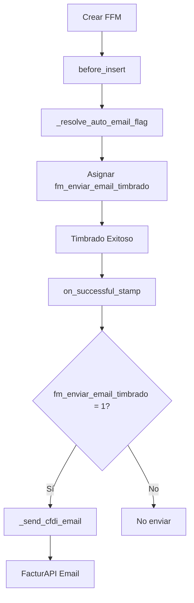

# Sistema Email CFDI - Documentación Técnica

## Arquitectura del Sistema

### Flujo Principal



## Componentes Principales

### 1. Backend Python

#### Función `_resolve_auto_email_flag(customer_name)`
```python
def _resolve_auto_email_flag(customer_name: str) -> bool:
    """
    Resuelve automáticamente si enviar email usando lógica cascade.

    Prioridad:
    1. Customer.fm_envio_email_cliente ("Enviar"/"No enviar")
    2. Settings.send_email_default (si Customer = "Default")
    3. False (por defecto)
    """
```

**Ubicación**: `factura_fiscal_mexico.py`
**Uso**: Llamada en `before_insert()` y funciones de resolución

#### Método `before_insert()`
```python
def before_insert(self):
    """Auto-asigna fm_enviar_email_timbrado usando lógica cascade."""
    try:
        from frappe.utils import cint
        flag = _resolve_auto_email_flag(self.customer)
        self.fm_enviar_email_timbrado = cint(flag)
    except Exception as e:
        self.fm_enviar_email_timbrado = 0
        frappe.logger().warning(f"[FFM before_insert] No se pudo resolver auto-email: {e}")
```

**Ubicación**: Clase `FacturaFiscalMexico`
**Propósito**: Auto-configuración campo en documentos nuevos

#### Método `on_successful_stamp()`
```python
def on_successful_stamp(self):
    """Llamado después de timbrado exitoso para envío automático."""
    from frappe.utils import cint

    if cint(getattr(self, "fm_enviar_email_timbrado", 0)) != 1:
        return

    # Enviar si hay destinatario
    _ = _send_cfdi_email(self)
```

**Ubicación**: Clase `FacturaFiscalMexico`
**Propósito**: Trigger automático post-timbrado

#### Función `_send_cfdi_email(doc, to_override=None)`
```python
def _send_cfdi_email(doc, to_override: str | None = None) -> dict:
    """
    Envía CFDI por email via FacturAPI.

    Args:
        doc: Documento FacturaFiscalMexico
        to_override: Email específico (opcional)

    Returns:
        dict: {"sent": bool, "to": str, "reason": str, "error": str}
    """
```

**Ubicación**: `factura_fiscal_mexico.py`
**Propósito**: Lógica core de envío email

#### Endpoint `action_send_cfdi_email(ffm_name, to=None)`
```python
@frappe.whitelist()
def action_send_cfdi_email(ffm_name: str, to: str | None = None):
    """Endpoint whitelisted para botón manual."""
    doc = frappe.get_doc("Factura Fiscal Mexico", ffm_name)
    frappe.has_permission(doctype="Factura Fiscal Mexico", ptype="write", doc=doc, throw=True)
    return _send_cfdi_email(doc, to_override=to)
```

**Ubicación**: `factura_fiscal_mexico.py`
**Propósito**: API para uso desde JavaScript

### 2. Cliente FacturAPI

#### Método `send_invoice_email(invoice_id, email)`
```python
def send_invoice_email(self, invoice_id: str, email: str) -> dict[str, Any]:
    """Enviar CFDI por email via FacturAPI."""
    endpoint = f"/invoices/{invoice_id}/email"
    data = {"email": email}
    return self._make_request("POST", endpoint, data)
```

**Ubicación**: `api_client.py` - Clase `FacturAPIClient`
**Propósito**: Integración directa con FacturAPI

### 3. Frontend JavaScript

#### Función `applyFFMUi(frm)`
```javascript
function applyFFMUi(frm) {
    // Gestión centralizada de todos los botones custom
    const is_submitted = frm.doc.docstatus === 1;
    const is_stamped = !!frm.doc.fm_uuid;

    if (is_submitted && is_stamped) {
        // Botones agrupados en dropdown "Comprobantes"
        frm.add_custom_button(__("Descargar PDF+XML"), ..., __("Comprobantes"));
        frm.add_custom_button(__("Enviar por email"), ..., __("Comprobantes"));
    }
}
```

**Ubicación**: `factura_fiscal_mexico.js`
**Propósito**: Gestión UI centralizada y consistente

## Custom Fields Requeridos

### Customer DocType
```json
{
    "fieldname": "fm_envio_email_cliente",
    "fieldtype": "Select",
    "label": "Envío Email Cliente",
    "options": "Default (usar settings)\nEnviar\nNo enviar",
    "default": "Default (usar settings)"
}
```

### Factura Fiscal Mexico DocType
```json
{
    "fieldname": "fm_enviar_email_timbrado",
    "fieldtype": "Check",
    "label": "Enviar CFDI por email al timbrar",
    "default": 0
}
```

### Facturacion Mexico Company Settings DocType (por compañía)
```json
{
    "fieldname": "send_email_default",
    "fieldtype": "Check",
    "label": "Enviar email por defecto al timbrar",
    "default": 0
},
{
    "fieldname": "customer_email_fallback",
    "fieldtype": "Data",
    "label": "Email fallback cliente",
    "options": "Email"
}
```

## Patrones de Desarrollo

### Gestión de Botones UI
```javascript
// ✅ CORRECTO - En applyFFMUi()
if (condition) {
    frm.add_custom_button(label, callback, group);
}

// ❌ INCORRECTO - En refresh() directamente
frm.add_custom_button(label, callback); // Se pierde al refresh
```

### Manejo de Errores
```python
# ✅ CORRECTO - Graceful degradation
try:
    flag = _resolve_auto_email_flag(self.customer)
    self.fm_enviar_email_timbrado = cint(flag)
except Exception as e:
    self.fm_enviar_email_timbrado = 0  # Valor seguro
    frappe.logger().warning(f"Error context: {e}")
```

### Lógica Cascade
```python
# Prioridad clara y documentada
def _resolve_auto_email_flag(customer_name: str) -> bool:
    # 1. Configuración específica del cliente
    if customer_setting in ["Enviar", "No enviar"]:
        return customer_setting == "Enviar"

    # 2. Configuración global Settings
    return bool(settings.send_email_default)
```

## Testing

### Unit Tests Recomendados
```python
def test_email_cascade_logic(self):
    """Test lógica cascade Customer/Settings."""
    # Customer = "Enviar", Settings = 0 → Debe retornar True
    # Customer = "No enviar", Settings = 1 → Debe retornar False
    # Customer = "Default", Settings = 1 → Debe retornar True

def test_before_insert_email_assignment(self):
    """Test auto-asignación en before_insert."""
    # Crear FFM nuevo → Verificar fm_enviar_email_timbrado correcto

def test_on_successful_stamp_trigger(self):
    """Test trigger automático post-timbrado."""
    # Mock timbrado exitoso → Verificar llamada a _send_cfdi_email
```

## Debugging

### Logs Clave
```python
# En before_insert()
frappe.logger().info(f"[FFM before_insert] Customer: {self.customer}, Flag resolved: {flag}")

# En on_successful_stamp()
frappe.logger().info(f"[FFM stamp] Email flag: {self.fm_enviar_email_timbrado}, Sending: {will_send}")

# En _send_cfdi_email()
frappe.logger().info(f"[FFM email] To: {to_email}, FacturAPI ID: {facturapi_id}")
```

### Verificación Estado
```python
# Verificar configuración cascade
flag = _resolve_auto_email_flag("CUSTOMER_NAME")
print(f"Email flag for customer: {flag}")

# Verificar custom fields
customer = frappe.get_doc("Customer", "CUSTOMER_NAME")
print(f"Customer email setting: {customer.fm_envio_email_cliente}")

settings = frappe.db.get_value(
    "Facturacion Mexico Company Settings",
    {"company": customer.represents_company or frappe.defaults.get_user_default("company")},
    ["send_email_default", "customer_email_fallback"],
    as_dict=True,
)
print(f"Company default: {settings.send_email_default if settings else None}")
```