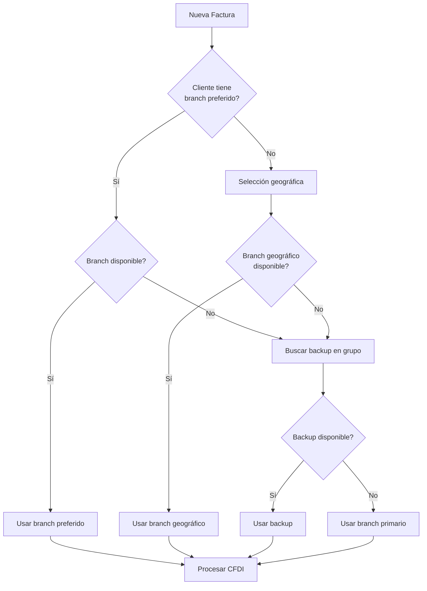

# Multi-sucursal - Guía de Usuario

Guía completa para configurar y usar el sistema multi-sucursal.

## 🏢 ¿Qué es Multi-sucursal?

El sistema multi-sucursal permite gestionar múltiples branches de tu empresa con:

- **Timbrado coordinado** entre sucursales
- **Selección automática** del branch óptimo
- **Failover automático** en caso de fallas
- **Balanceo de carga** inteligente

## ⚙️ Configuración Inicial

### 1. Habilitar Multi-sucursal

En tu `site_config.json`:

```json
{
  "multisucursal_enabled": 1,
  "multisucursal_coordination": 1,
  "branch_failover_enabled": 1
}
```

### 2. Crear Branches

#### Branch Principal (Matriz)

1. Ve a **Setup > Facturación México > Branches**
2. Clic en **New Branch**
3. Completa los datos:

```
Branch Code: MATRIZ_01
Branch Name: Casa Matriz
Is Primary: ✓ (marcado)
PAC Provider: finkok
Status: Active
Coordination Group: GRUPO_CENTRO
```

#### Branches Secundarios

Repite el proceso para cada sucursal:

```
Branch Code: NORTE_01
Branch Name: Sucursal Norte
Is Primary: ✗ (desmarcado)  
PAC Provider: finkok
Status: Active
Coordination Group: GRUPO_NORTE
```

### 3. Configurar Credenciales PAC

Para cada branch, configura credenciales PAC independientes:

```json
// En Branch configuration
{
  "pac_credentials": {
    "username": "user_sucursal_01",
    "password": "pass_sucursal_01",
    "test_mode": false
  }
}
```

## 📋 Uso Diario

### Selección Automática de Branch

El sistema selecciona automáticamente el branch óptimo basado en:

1. **Cliente específico**: Preferencias configuradas
2. **Ubicación geográfica**: Proximidad del cliente
3. **Disponibilidad**: Estado del PAC provider
4. **Carga actual**: Balanceo de operaciones

### Crear Factura Multi-sucursal

#### Proceso Normal

1. Crear **Sales Invoice** normalmente
2. El sistema automáticamente:
   - Selecciona el branch óptimo
   - Configura credenciales PAC
   - Genera CFDI con datos del branch

#### Override Manual

Si necesitas forzar un branch específico:

1. En Sales Invoice, ve a **More > Facturación México**
2. Selecciona **Force Branch**: `NORTE_01`
3. Submit normalmente

### Monitorear Estado de Branches

#### Dashboard Multi-sucursal

Ve a **Facturación México > Multi-sucursal Dashboard**:

- **Branch Status**: Estado actual de cada sucursal
- **PAC Connectivity**: Conectividad con proveedores
- **Volume Distribution**: Distribución de carga
- **Response Times**: Tiempos de respuesta

#### Métricas por Branch

```python
# Consultar métricas desde consola
import frappe
from facturacion_mexico.multisucursal.metrics import get_branch_metrics

metrics = get_branch_metrics("NORTE_01", days=7)
print(f"CFDIs procesados: {metrics['total_invoices']}")
print(f"Tasa de éxito: {metrics['success_rate']}%")
print(f"Tiempo promedio: {metrics['avg_response_time']}ms")
```

## 🔄 Coordinación entre Branches

### Grupos de Coordinación

Los branches se organizan en grupos para optimizar la coordinación:

```python
COORDINATION_GROUPS = {
    "GRUPO_NORTE": {
        "branches": ["TIJUANA_01", "MONTERREY_01", "CHIHUAHUA_01"],
        "primary": "MONTERREY_01",
        "backup_priority": ["TIJUANA_01", "CHIHUAHUA_01"]
    },
    "GRUPO_CENTRO": {
        "branches": ["MEXICO_01", "GUADALAJARA_01", "PUEBLA_01"], 
        "primary": "MEXICO_01",
        "backup_priority": ["GUADALAJARA_01", "PUEBLA_01"]
    }
}
```

### Algoritmo de Selección



## 🚨 Manejo de Failover

### Detección de Fallas

El sistema monitorea continuamente:

- **Conectividad PAC**: Ping cada 30 segundos
- **Respuesta de timbrado**: Timeout < 10 segundos
- **Tasa de errores**: Máximo 5% en ventana de 5 minutos

### Proceso de Failover

Cuando se detecta una falla:

1. **Marcar branch como no disponible**
2. **Seleccionar backup del mismo grupo**
3. **Transferir operaciones pendientes**
4. **Notificar a administradores**

### Recuperación Automática

```python
# Configurar recuperación automática
FAILOVER_CONFIG = {
    "auto_recovery": True,
    "health_check_interval": 30,  # segundos
    "recovery_threshold": 3,      # checks exitosos consecutivos
    "max_retry_attempts": 5
}
```

## 📊 Reportes y Analytics

### Reporte de Distribución

Ve a **Reports > Facturación México > Branch Distribution Report**:

- CFDIs por branch por período
- Distribución de clientes
- Volumen de facturación
- Métricas de performance

### Análisis de Failover

```python
# Generar reporte de failover
from facturacion_mexico.multisucursal.reports import generate_failover_report

report = generate_failover_report(
    from_date="2025-01-01",
    to_date="2025-01-31"
)

print(f"Total failovers: {report['total_failovers']}")
print(f"Tiempo promedio de recuperación: {report['avg_recovery_time']} segundos")
print(f"Branch más estable: {report['most_stable_branch']}")
```

## 🔧 Configuración Avanzada

### Políticas de Selección

```python
# Personalizar algoritmo de selección
SELECTION_POLICIES = {
    "geographic_priority": True,     # Priorizar cercanía geográfica  
    "load_balancing": True,          # Balancear carga entre branches
    "cost_optimization": False,      # Optimizar por costo vs velocidad
    "client_affinity": True,         # Mantener afinidad por cliente
    "peak_hour_routing": True        # Ruteo especial en horas pico
}
```

### Configuración por Cliente

```python
# Configurar branch específico para cliente
customer_doc = frappe.get_doc("Customer", "WALMART-001")
customer_doc.preferred_branch = "NORTE_01"
customer_doc.backup_branches = ["CENTRO_01", "SUR_01"]
customer_doc.save()
```

### Alertas y Notificaciones

```python
# Configurar alertas
ALERT_CONFIG = {
    "branch_down": {
        "enabled": True,
        "recipients": ["admin@empresa.com", "operaciones@empresa.com"],
        "channels": ["email", "slack"]
    },
    "high_error_rate": {
        "enabled": True,
        "threshold": 5,  # porcentaje
        "time_window": 300  # segundos
    }
}
```

## 🛠️ Troubleshooting

### Branch No Responde

**Síntomas:**
- Timeouts en timbrado
- Errores de conectividad PAC

**Solución:**
1. Verificar conectividad de red
2. Revisar credenciales PAC
3. Comprobar estado del servicio PAC

```python
# Diagnosticar branch
from facturacion_mexico.multisucursal.diagnostics import diagnose_branch

result = diagnose_branch("NORTE_01")
print(f"Status: {result['status']}")
print(f"Issues: {result['issues']}")
print(f"Recommendations: {result['recommendations']}")
```

### Failover No Funciona

**Síntomas:**
- Fallas no se detectan automáticamente
- Backup branches no se activan

**Solución:**
1. Verificar configuración de health checks
2. Revisar logs de coordination service
3. Comprobar configuración de grupos

```bash
# Revisar logs de coordinación
tail -f logs/multisucursal-coordination.log

# Forzar health check manual
bench --site tu-sitio.local execute facturacion_mexico.multisucursal.coordination.force_health_check
```

### Distribución Desbalanceada

**Síntomas:**
- Un branch procesa mucho más que otros
- Tiempos de respuesta dispares

**Solución:**
1. Revisar algoritmo de balanceo
2. Ajustar pesos de distribución
3. Verificar capacidad de branches

```python
# Ajustar pesos de balanceo
branch_weights = {
    "MATRIZ_01": 0.4,    # 40% de la carga
    "NORTE_01": 0.3,     # 30% de la carga  
    "SUR_01": 0.3        # 30% de la carga
}

frappe.db.set_value("Branch Settings", None, "load_distribution_weights", 
                   json.dumps(branch_weights))
```

---

!!! success "Sistema Resiliente"
    El sistema multi-sucursal garantiza 99.9% de disponibilidad con failover automático.

!!! tip "Optimización"
    Agrupa branches geográficamente cercanos para minimizar latencia en coordinación.

!!! warning "Monitoreo Continuo"
    Configura alertas proactivas para detectar problemas antes que afecten usuarios.